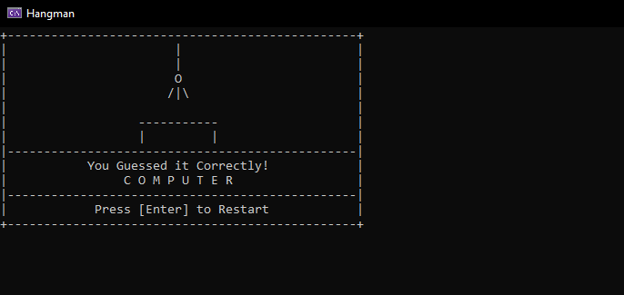
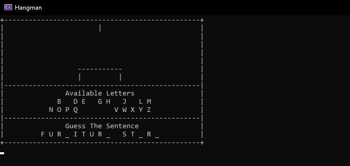

## Hangman
It's a clone of the classic Hangman written in objective C++.

### Features
- Support for custom dictionary
- Beautiful 1 bit graphics
- Questionably advanced text printing algorithm

I coded this 4 years ago and thought I'd share.